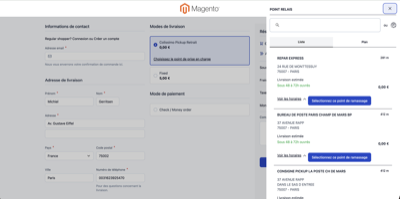
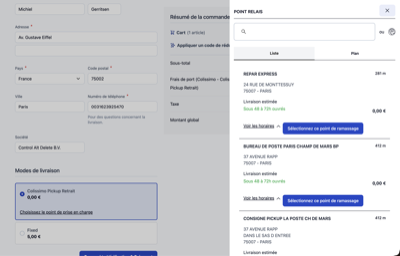
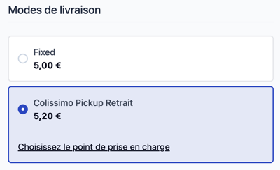
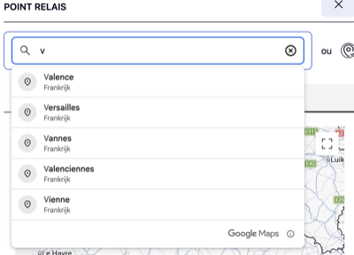
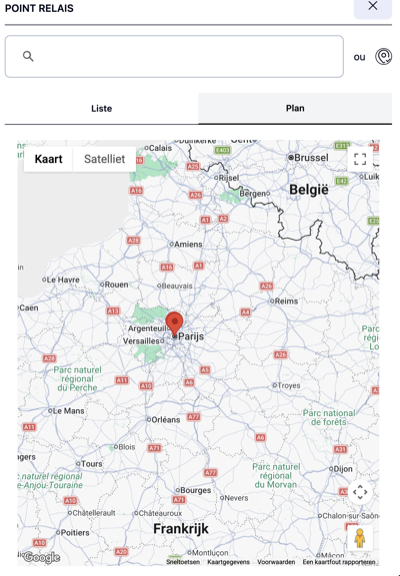
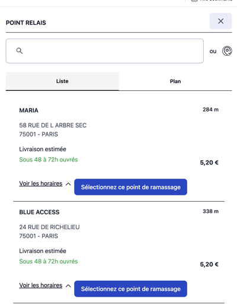
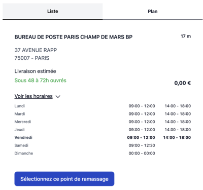
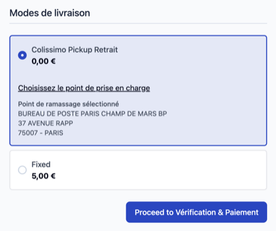

# Colissimo Relay Point Picker for Hyvä Checkout

A Magento 2 module that integrates Colissimo relay point selection into the [Hyvä Checkout](https://www.hyva.io/hyva-checkout.html) experience.

Developed by **[Control Alt Delete BV](https://www.controlaltdelete.dev/checkout-services/hyva-checkout)** — a Magento and Hyvä specialist agency with deep expertise in [Hyvä Checkout integrations](https://www.controlaltdelete.dev/checkout-services/hyva-checkout). We've built production-grade shipping, payment, and pickup-point integrations for merchants across Europe, and we hold ourselves to a high bar: the proof is in the pudding — this repo ships with automated end-to-end tests so you know the checkout flow keeps working.

This module is an independent, community-developed integration. It is not affiliated with, endorsed by, or developed in partnership with La Poste or Colissimo.

---

## Screenshots

<table>
  <tr>
    <td align="center" width="33%">
      <a href="https://github.com/controlaltdelete-nl/magento2-colissimo-hyva-checkout/raw/main/docs/overview-onepage-checkout.png" target="_blank"></a><br/>
      <sub>Onepage checkout</sub>
    </td>
    <td align="center" width="33%">
      <a href="https://github.com/controlaltdelete-nl/magento2-colissimo-hyva-checkout/raw/main/docs/overview-multistep-checkout.png" target="_blank"></a><br/>
      <sub>Multistep checkout</sub>
    </td>
    <td align="center" width="33%">
      <a href="https://github.com/controlaltdelete-nl/magento2-colissimo-hyva-checkout/raw/main/docs/delivery-method-label.png" target="_blank"></a><br/>
      <sub>Delivery method label</sub>
    </td>
  </tr>
  <tr>
    <td align="center" width="33%">
      <a href="https://github.com/controlaltdelete-nl/magento2-colissimo-hyva-checkout/raw/main/docs/locations-searchbar.png" target="_blank"></a><br/>
      <sub>Address search</sub>
    </td>
    <td align="center" width="33%">
      <a href="https://github.com/controlaltdelete-nl/magento2-colissimo-hyva-checkout/raw/main/docs/colissimo-google-maps-locations.png" target="_blank"></a><br/>
      <sub>Google Maps view</sub>
    </td>
    <td align="center" width="33%">
      <a href="https://github.com/controlaltdelete-nl/magento2-colissimo-hyva-checkout/raw/main/docs/colissimo-list-pick-up-points.png" target="_blank"></a><br/>
      <sub>Pick-up points list</sub>
    </td>
  </tr>
  <tr>
    <td align="center" width="33%">
      <a href="https://github.com/controlaltdelete-nl/magento2-colissimo-hyva-checkout/raw/main/docs/colissimo-available-times.png" target="_blank"></a><br/>
      <sub>Opening hours</sub>
    </td>
    <td align="center" width="33%">
      <a href="https://github.com/controlaltdelete-nl/magento2-colissimo-hyva-checkout/raw/main/docs/selected-relay-point.png" target="_blank"></a><br/>
      <sub>Selected relay point</sub>
    </td>
    <td width="33%"></td>
  </tr>
</table>

---

## Overview

When customers choose the Colissimo relay point (PR) shipping method during checkout, this module presents an interactive picker that lets them search for and select a nearby relay point -- either by entering an address, using their browser's geolocation, or browsing an embedded Google Map.

The selected relay point is saved to the quote and passed along to the order, making it available for fulfilment via the standard Colissimo module.

## Features

- Relay point search by address (with Google Places autocomplete) or by geolocation
- Interactive Google Map with markers for all available relay points
- List/map view toggle for browsing results
- Opening hours accordion per relay point
- Fully reactive UI using Magewire and Alpine.js
- Validates checkout step completion (customer must pick a point before proceeding)
- Stores selected relay point in the checkout session for downstream processing
- Admin configuration for Google Maps API key, default region, and map starting coordinates

## Requirements

| Dependency | Version |
|---|---|
| PHP | 8.1 or higher |
| Magento | 2.4.4 or higher |
| [La Poste Colissimo module](https://commercemarketplace.adobe.com/laposte-magento2-colissimo-module.html) | * |
| Hyvä Checkout | 1.3 or higher |
| Google Maps API key | -- |

The La Poste Colissimo module is **free** and must be downloaded and installed separately from the [Adobe Commerce Marketplace](https://commercemarketplace.adobe.com/laposte-magento2-colissimo-module.html). This module is a compatibility layer on top of it — it does not replace or include the Colissimo shipping logic itself.

A Google Maps API key with the following APIs enabled is required:

- Maps JavaScript API
- Places API
- Geocoding API

> **Note:** Billing must be enabled on your Google Cloud project, even if you stay within Google's free tier. Requests from a key that has no billing account attached will fail silently, and the map will render blank with an `ApiNotActivatedMapError` or similar message in the browser console.

## Installation

Install via Composer:

```bash
composer require controlaltdelete/magento2-colissimo-hyva-checkout
bin/magento module:enable ControlAltDelete_ColissimoHyva
bin/magento setup:upgrade
```

## Configuration

Go to **Stores > Configuration > Carriers > LaPoste > Hyvä Checkout integration** and fill in:

| Field | Description |
|---|---|
| Google Maps API Key | Your Google Maps API key |
| Region | Default geocoding region (default: `fr`) |
| Starting Latitude | Initial map centre latitude (default: `48.8566`, Paris) |
| Starting Longitude | Initial map centre longitude (default: `2.3522`, Paris) |

## How It Works

1. The customer selects the Colissimo relay point (PR) shipping method in Hyvä Checkout.
2. A relay picker modal is shown, prompting the customer to find a pickup point.
3. The customer searches by address or uses their device location.
4. Available relay points are fetched from the Colissimo API and displayed as a list and on a map.
5. When the customer selects a relay point, the quote's shipping address is updated with the relay point's details (name, address, postal code, city, country).
6. The selected relay information is persisted in the checkout session.
7. The checkout step validates that a relay point has been selected before allowing the customer to proceed.

## Testing

The proof is in the pudding: this repository ships with a full suite of automated end-to-end tests written in [Playwright](https://playwright.dev/), covering the relay-point picker, address search, map interactions, and the full checkout flow from cart to order confirmation.

Every change is validated against these tests before it lands, so you can upgrade with confidence that the checkout integration keeps working in both onepage and multistep Hyvä Checkout layouts.

```bash
npm install
npx playwright test
```

Test reports are written to `playwright-report/`.

## Troubleshooting

**The relay picker opens but the map is blank or the address autocomplete doesn't work.**
Check the browser console for errors from `maps.googleapis.com`. The most common causes are:
- The Google Maps API key has no billing account attached on the Google Cloud project.
- One of the required APIs (Maps JavaScript API, Places API, Geocoding API) is not enabled.
- HTTP referrer restrictions on the key don't include your storefront domain.

**"Please select a pickup point before proceeding" keeps showing after I picked one.**
The selected point is stored in the checkout session under `lpc_relay_information`. If this keeps happening, check that the underlying La Poste Colissimo module is properly configured (account credentials, relay-point shipping method enabled) and that the shipping method code is `colissimo_pr`.

**Pickup points fail to load ("An error occurred while fetching pickup points").**
This call goes through the La Poste Colissimo SOAP API. Check `var/log/system.log` / `exception.log` — this module logs the upstream error message. Verify the Colissimo account credentials and that the shipping address country is one Colissimo services.

**The map view shows deprecation warnings in the browser console.**
This module currently uses `google.maps.Marker`, which Google has deprecated in favour of `AdvancedMarkerElement`. The markers still render today; migration is on the roadmap.

## Changelog

See the [GitHub Releases page](https://github.com/controlaltdelete-nl/magento2-colissimo-hyva-checkout/releases) for version history and upgrade notes.

Automated testing is a core part of how [Control Alt Delete](https://www.controlaltdelete.dev/checkout-services/hyva-checkout) delivers checkout integrations — if you need a bespoke shipping, payment, or pickup-point integration for Hyvä Checkout, [get in touch](https://www.controlaltdelete.dev/checkout-services/hyva-checkout).

---

## About Control Alt Delete

[Control Alt Delete BV](https://www.controlaltdelete.dev/checkout-services/hyva-checkout) is a Magento and Hyvä specialist agency. We build fast, maintainable storefronts and open-source tooling for the Magento ecosystem, with a particular focus on **Hyvä Checkout integrations** — shipping methods, payment providers, pickup-point pickers, and custom checkout steps.

Every integration we ship is backed by automated end-to-end tests, because a checkout that silently breaks is worse than no checkout at all. The proof is in the pudding: this repo is a live example of how we work.

- Hyvä Checkout services: [controlaltdelete.dev/checkout-services/hyva-checkout](https://www.controlaltdelete.dev/checkout-services/hyva-checkout)
- Website: [controlaltdelete.dev](https://www.controlaltdelete.dev)
- GitHub: [github.com/controlaltdelete-nl](https://github.com/controlaltdelete-nl)

## Disclaimer

This module is developed and maintained by [Control Alt Delete BV](https://www.controlaltdelete.dev). It has no affiliation with La Poste, Colissimo, or any of their subsidiaries. All Colissimo trademarks and service names belong to their respective owners.

## License

Released under the [MIT License](https://opensource.org/licenses/MIT). Copyright (c) Control Alt Delete BV.
